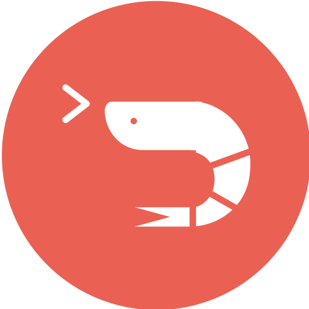

<div align="center">

</div>

<div style="position: absolute; top: 0; left: 0;">
</img>
</div>

</br>
</br>


<h3 align="center"> 
<i> 
 
[](https://git.io/typing-svg)
 
 </i> 
 </h3>
</br>


<h2>🌸 About</h2>

> Me and Myself.

- ⌨️ Currently attending high school
- 📚 Developing addiction to software engineering
- 🏷 Sex: _male_
- 🗣️ Languages: _italian, english_
- 🐈 __Interests:__
- 
      AI (Deep Learning, Neural Systems, LLM, ML, NLP);
      Software Engineering;
      Reverse Engineering;
      Cyber-security;
          

      
</br>
<h2>🌐 Socials</h2>

> Self explanatory...

- Telegram: [@wqpoy](https://t.me/wqpoy)
- Discord (username): [mwttjq](https://discord.com/users/885982488281878658)
- [Spotify](https://open.spotify.com/user/0bbesq3z1jnm8lb5uy8334p8h)

</br>
<h2>🔨 Languages and Tools</h2>

> Stuff I'm learning or I work with.

</br>

```ruby
Learning:                      Medium-knowledge:                       High-knowledge:
            
Java {Swing, JavaFX},          HTML/CSS {Tailwind, scss},              Javascript {Electron, React.js, Express}
Python,                        Typescript,
C++                            Rust


OS:
Kali Linux, Windows, Ubuntu;

Text Editor/IDE:
VSC, VS, Intellij, Neovim, Eclipse;

Hosting & Database:
Heroku, DigitalOcean, Linode, AWS, MySQL, MongoDB;

```` 


 </i> </p>
 
