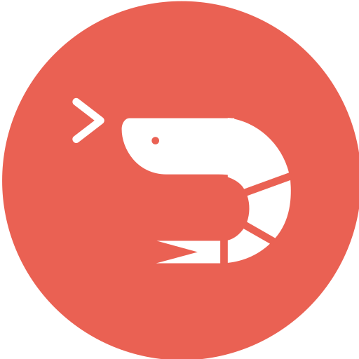

<div align="left">
  
  <a href="https://git.io/typing-svg">
    
  </a>
</div>

> ### 🧠 About Me

Hi! I'm a high school student with a growing passion for software engineering and creative coding.

- 🎓 Currently in high school
- 💻 Learning to love backends and frontends equally. UPDATE: I fucking hate front-end.
- 🌍 I speak **Italian** (native) and **English** (fluent-ish)
- 🌸 I code for curiosity, expression and sometimes just for fun (which means embracing despair.)


---

> ### 🌐 Where to Find Me

- 💌 reakjra@proton.me
- 💬 Telegram: [@vxsrea](https://t.me/vxsrea)
- 🕹 Discord: [mwttjq](https://discord.com/users/885982488281878658)
- 🎧 [Spotify](https://open.spotify.com/user/0bbesq3z1jnm8lb5uy8334p8h)

---

> ## 🔧 Technologies & Tools

I love learning new things, here’s what I’m currently exploring:

```yaml
🔹 Learning:
  - Java (Swing, JavaFX)
  - Python
  - C++
  - Rust

🔸 Intermediate:
  - HTML/CSS (Tailwind, SCSS)
  - TypeScript

⭐ Confident with:
  - JavaScript (Electron, React.js, Express)

🖥 OS:
  - EndeavourOS, Windows 11

🧠 Editors & IDEs:
  - VS Code, IntelliJ, Eclipse

☁️ Hosting & DB:
  - Heroku, DigitalOcean, AWS
  - MySQL, MongoDB
```
<hr>
<p align="center">
  
  <br>
  <br>
 ⌜おやすみ、黒い花。⌟ &emsp; ✦ &emsp; ✦ &emsp; ✦ &emsp;  ⌜舉杯邀明月⌟ &emsp; ✦ &emsp; ✦ &emsp; ✦ &emsp;  ⌜모난 말을 숨기고서 별을 읽었지⌟
</p>

